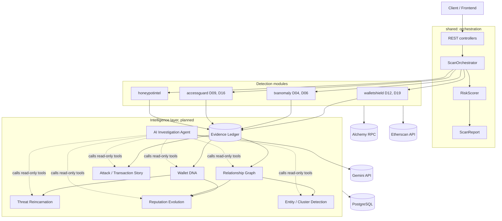
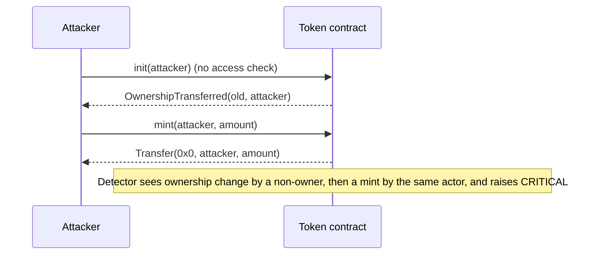
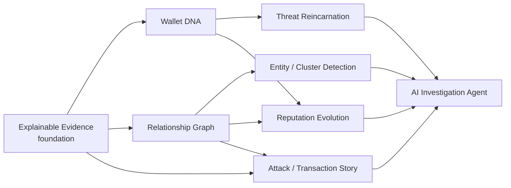
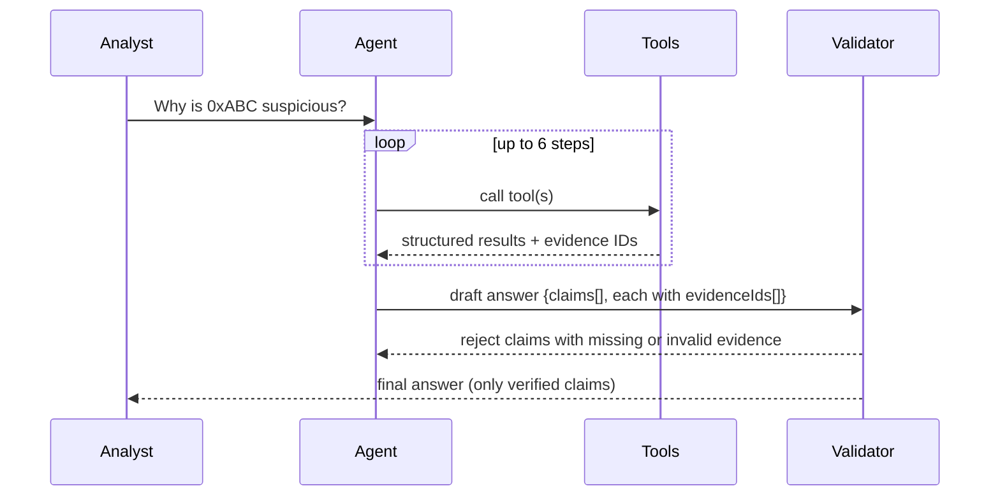

# Web3Shield

**A real-time, evidence-first security engine for Ethereum wallets, transactions and smart contracts.**

Web3Shield answers three questions about any address or transaction:

1. **Is it dangerous?** A set of detectors produces findings with a severity and a confidence.
2. **Why do we think so?** Every finding is backed by on-chain evidence you can verify yourself.
3. **What happened?** The engine turns raw transactions into a readable story and connects related wallets, contracts and past threats.

> **Design principle: no evidence, no finding.** A detector that cannot prove a claim on-chain must say
> *inconclusive*. It must never report "safe" because it failed to look.

---

## Table of contents

1. [Project status](#1-project-status)
2. [Architecture](#2-architecture)
3. [Current modules](#3-current-modules)
4. [AccessGuard in depth (D09 and D16)](#4-accessguard-in-depth-d09-and-d16)
5. [The Intelligence Layer (what we add)](#5-the-intelligence-layer-what-we-add)
6. [API reference](#6-api-reference)
7. [Data model](#7-data-model)
8. [Getting started](#8-getting-started)
9. [Configuration and secrets](#9-configuration-and-secrets)
10. [Testing and evaluation](#10-testing-and-evaluation)
11. [Security, privacy and ethics](#11-security-privacy-and-ethics)
12. [Limitations](#12-limitations)
13. [Roadmap](#13-roadmap)
14. [Glossary](#14-glossary)

---

## 1. Project status

This README covers both what is **built today** and what is **designed and planned**. The status column is the
source of truth, so nothing planned is presented as finished.

| Area | Component | Status |
|---|---|---|
| Core | Orchestrator, unified `DetectionResult`, `RiskScorer`, `ScanReport` | Built |
| Core | Auth (signup/login), CORS, Alchemy config | Built |
| Detectors | D04 Abnormal Gas & Calldata, D06 Reverted Transaction (`txanomaly`) | Built |
| Detectors | D12 Rapid Wallet Drain, D19 Suspicious Burner Wallet (`walletshield`) | Built |
| Detectors | D09 Unauthorized Minting, D16 Ownership Hijack (`accessguard`) | Built (runs standalone; see section 4) |
| Detectors | Honeypot check (`honeypotintel`), Threat Memory | Honeypot built; Threat Memory is a stub |
| Intelligence | Wallet DNA | Designed |
| Intelligence | Relationship Graph | Designed |
| Intelligence | Threat Reincarnation | Designed |
| Intelligence | Reputation Evolution | Designed |
| Intelligence | Entity / Cluster Detection | Designed |
| Intelligence | AI Investigation Agent | Designed (Gemini key already configurable) |
| Intelligence | Attack / Transaction Story | Designed |
| Intelligence | Explainable Evidence | Designed (builds on the existing `Evidence` record) |

---

## 2. Architecture

Web3Shield is a modular monolith (Spring Boot 4, Java 21). Each module owns its detectors and exposes a small
`ScanModule` service. The orchestrator discovers every module automatically, so adding a module needs no central wiring.



### Core contracts (already in the code)

| Type | Role |
|---|---|
| `Detector<C>` | Every detector implements `id()`, `name()` and `detect(context)`. It must not throw. If data is missing it returns `inconclusive`. |
| `ScanModule` | A module's service implements `moduleName()`, `supports(request)` and `scan(request)`. The orchestrator finds these beans on its own. |
| `DetectionResult` | Unified output: `detectorId`, `triggered`, `severity`, `confidence` (0 to 1), `dataQuality`, `summary`, `evidence`. The constructor sanitises bad input. |
| `Evidence` | One proof item, `(label, value)`, for example `("txHash", "0x...")`. |
| `Severity` | `INFO < LOW < MEDIUM < HIGH < CRITICAL`. |
| `DataQuality` | `FULL`, `PARTIAL`, `INCONCLUSIVE`. Makes "could not check" different from "clean". |

### Risk scoring

Each triggered finding contributes `p = severityFactor x confidence`, with factors
`LOW 0.10, MEDIUM 0.30, HIGH 0.60, CRITICAL 0.90`. Findings combine as:

```
risk = 1 - product(1 - p)        (0 to 100 after scaling)
```

The score rises with every additional finding but never passes 100, and one weak finding cannot dominate.
When detectors are inconclusive, the report says: *a low score does not mean the target is safe*.

---

## 3. Current modules

| Module | Endpoint | Detectors | What it looks at |
|---|---|---|---|
| `shared/orchestrator` | `POST /api/v1/scans`, `GET /api/v1/scans/detectors` | none (merges all modules) | Runs every module that supports the request and returns one merged report |
| `walletshield` | `GET /api/v1/wallets/{address}/analyze` | **D12** Rapid Wallet Drain, **D19** Suspicious Burner Wallet | Transfer bursts in a 5-minute window (3 or more outbound), wallet age under 1h and 24h, short lifespan, depleted balance (0.005 ETH or less) |
| `txanomaly` | `GET /api/v1/tx/{txHash}/analyze` | **D04** Abnormal Gas & Calldata, **D06** Reverted Transaction | Robust statistics (median and MAD, z-score above 3.5, and at least 1.5x median) against the sender's own history; revert reason decoding; repeated failures |
| `accessguard` | `GET /api/v1/access/{contract}/analyze?blocks=1000` | **D09** Unauthorized Mint, **D16** Ownership Hijack | Event logs of a contract (`Transfer` from `0x0`, `OwnershipTransferred`) |
| `honeypotintel` | `GET /api/honeypot/check?address=` | Honeypot check | Contract behaviour checks. `ThreatMemoryDetector` is a placeholder for the reincarnation work in section 5. |
| `auth` | `POST /api/auth/signup`, `POST /api/auth/login` | none | User accounts (PostgreSQL) |

`POST /api/v1/scans` accepts `{ "address": "0x...", "txHash": "0x..." }` (at least one). Addresses must be 0x plus
40 hex characters and hashes 0x plus 64 hex characters. Anything else returns `400`.

---

## 4. AccessGuard in depth (D09 and D16)

AccessGuard detects the two most damaging access-control failures: **who may create tokens**, and **who owns the contract**.
Both share one root cause: *an unprotected setup function lets the wrong party gain power.*

### D09: Unauthorized Token Minting

| | |
|---|---|
| **Problem** | A `mint` function should work only for a trusted minter. If the function that assigns the minter (for example `init()`) has no access check, anyone can become the minter and create unlimited tokens. |
| **Real case** | 88mph (2021): an unprotected `init()`. Verify the loss figures against the public post-mortem before citing them. |
| **Signal** | A `Transfer` event whose `from` is the zero address is a mint. |
| **Detector** | Counts mints in a block window, measures them as a share of `totalSupply` (over 1% is MEDIUM, over 10% is HIGH), samples the transaction senders, and checks each against the contract's own access control: `isMinter(addr)`, then `hasRole(MINTER_ROLE, addr)`, then equality with `minter()` or `owner()`. |
| **Fix** | Assign the minter once in the constructor and mark it `immutable`, add a hard supply cap, and optionally a mint velocity limiter. |

### D16: Ownership / Access Hijack

| | |
|---|---|
| **Problem** | If the initializer that sets the owner (for example `initWallet()`) is callable by anyone, anyone can declare themselves owner. |
| **Real case** | Parity multisig wallets (July 2017): a public initializer reached through `delegatecall` let an attacker take ownership and withdraw about $30M. |
| **Signal** | `OwnershipTransferred(previousOwner, newOwner)`. |
| **Detector** | Compares the transaction sender with the previous owner. Sender equals previous owner: INFO. Previous owner is a contract (multisig or proxy): MEDIUM. Previous owner is a normal wallet and someone else moved ownership: HIGH. Owner set from the zero address on an already-deployed contract: MEDIUM. |
| **Fix** | One-time `initializer`, `_disableInitializers()` on implementations, two-step ownership transfer, multisig plus timelock for admin rights. |

### Attack-chain correlation (D09 + D16)

Real attacks are a sequence, not two separate events. `AttackCorrelationDetector` raises **CRITICAL** when someone takes
ownership from a different party and then mints within 300 blocks:



### Running AccessGuard on its own

The full API needs PostgreSQL. To test the detectors without a database, run the `AccessGuardDemo` class directly
(use the green arrow beside its `main` method, not the application's Run button):

```
AccessGuardDemo <contract> <rpcUrl> <blocks>
```

All three arguments are optional. Expected result on a healthy contract such as USDC: D09 rated INFO with
"all sampled minters are authorised", and no D16 or CRITICAL finding.

### Why the verdicts are conservative

- The check uses `tx.from` and `tx.to`. Reading the exact internal caller needs a trace API that free RPC plans lack, so mints routed through another contract are rated MEDIUM ("verify the intermediary") rather than HIGH.
- The `owner()` / `minter()` fallback reads *current* state, so a hijacker who already took ownership looks authorised. The correlation detector exists to catch exactly that case.
- Free public RPC nodes reject old block ranges as "archive" requests. Use an Alchemy or Infura key for longer windows.

---

## 5. The Intelligence Layer (what we add)

The detectors answer "is this suspicious right now?". The intelligence layer answers the follow-up questions an
analyst asks next. It sits on top of the existing modules and reuses their data, contracts and conventions.

| New component | What it does | Main question it answers |
|---|---|---|
| **Wallet DNA** | Builds a behavioural fingerprint | "How does this wallet behave?" |
| **Relationship Graph** | Maps wallets, contracts and funding paths | "Who or what is connected?" |
| **Threat Reincarnation** | Compares new wallets with previous threat behaviour | "Is this a new address behaving like an old threat?" |
| **Reputation Evolution** | Tracks behaviour and risk changes over time | "What changed?" |
| **Entity / Cluster Detection** | Groups addresses with strong behavioural or transaction relationships | "Which addresses may belong to the same activity cluster?" |
| **AI Investigation Agent** | Automatically investigates evidence using our own analysis tools | "Why is this suspicious?" |
| **Attack / Transaction Story** | Converts raw transactions into an understandable sequence | "What happened?" |
| **Explainable Evidence** | Links every finding to actual transactions and contracts | "What evidence supports this?" |

### 5.0 How the pieces depend on each other



**Build order follows the arrows:** evidence first, then DNA and graph, then the components that consume them, and the
agent last. The agent is only as trustworthy as the tools underneath it.

New code lives in a package `intel` next to the existing modules. Each sub-package follows the same convention
as the current modules (`controller`, `service`, `detector`, `client`, `model`):

```
com.web3shield.web3shieldbackend.intel
 |-- evidence/        Evidence ledger, EvidenceItem, explorer links
 |-- walletdna/       DNA feature extraction, fingerprint, archetypes
 |-- graph/           nodes, edges, funding paths, bounded traversal
 |-- reincarnation/   threat library, similarity, matching
 |-- reputation/      snapshots, trends, change detection, decay
 |-- cluster/         heuristics, weighted union-find, hub filtering
 |-- story/           timeline builder, phase classifier, templates
 `-- agent/           Gemini client, tool registry, guardrails, validator
```

Detector IDs for new detectors use the `I` prefix (`I01` to `I08`) so they never clash with the team's `Dxx` catalogue.

---

### 5.1 Explainable Evidence (the foundation)

**Goal:** every claim the system makes can be checked by a human against the chain.

**Rules**

1. A triggered `DetectionResult` must carry at least one evidence item. Otherwise it must be `INCONCLUSIVE`.
2. Evidence items are immutable, addressable by ID, and stored once (shared between the report, the story and the agent).
3. Each item says where it came from and how to reproduce it.

**Evidence item** (additive: the current `Evidence(label, value)` record stays and is mapped into this)

| Field | Example |
|---|---|
| `id` | `ev_9f3c...` (hash of kind + ref + block) |
| `kind` | `TX`, `LOG`, `CONTRACT_CODE`, `BALANCE`, `CALL_RESULT`, `LABEL`, `DERIVED` |
| `ref` | Transaction hash, address, or log index |
| `blockNumber` / `timestamp` | `26011904` / ISO time |
| `source` | `alchemy:eth_getLogs`, `etherscan:txlist` |
| `reproduce` | The exact RPC method and filter that returns this item |
| `explorerUrl` | Link to the transaction or address on Etherscan |
| `derivedFrom` | IDs of evidence this item was computed from (for `DERIVED` only) |

**Score explanation.** Reports include, per triggered detector, the contribution `severityFactor x confidence` and the
resulting score, plus "what we could not check" (all inconclusive detectors). This makes the number auditable.

**Endpoint:** `GET /api/v1/evidence/{evidenceId}` and an `explain` block in every scan report.

---

### 5.2 Wallet DNA

**Goal:** a compact, comparable behavioural fingerprint of an address.

**Features** (all computed from data the wallet module already fetches)

| Group | Features |
|---|---|
| Age and volume | Age in hours, nonce, total transaction count, first-to-last activity span |
| Timing | Median gap between transactions, longest burst (transactions per 5 minutes), 24-bin hour-of-day histogram and its entropy |
| Value | Log-scaled median and maximum transfer, share of native versus token transfers, balance-depletion ratio |
| Counterparties | Distinct counterparties, in/out ratio, top-counterparty concentration, share of contract interactions |
| Risk-relevant | Approval count, revert rate, fraction of funds forwarded within N minutes of receipt |

**Method**

1. Extract raw features. Reuse `RobustStats` (median and MAD) from `txanomaly.util` to normalise, so one huge transfer does not distort the vector.
2. Produce a fixed-length numeric vector, versioned with `dnaVersion` so old and new fingerprints are never compared.
3. Assign readable **archetype tags** by rules, for example `BURNER`, `SWEEPER`, `HIGH_FREQUENCY_BOT`, `LONG_LIVED_HOLDER`, `NEW_UNKNOWN`.
4. Set `dataQuality`: fewer than 30 transactions is at most `PARTIAL`; under 5 is `INCONCLUSIVE`. Never compute a confident fingerprint from a handful of transactions.

**Output** `WalletDna { address, dnaVersion, vector[], archetypes[], features{}, evidenceIds[], dataQuality }`

**Endpoint:** `GET /api/v1/wallets/{address}/dna`

---

### 5.3 Relationship Graph

**Goal:** show who and what an address is connected to, and how money got there.

**Nodes:** `WALLET`, `CONTRACT`, `TOKEN`, `LABELLED_ENTITY` (exchange, router, bridge, known threat).
**Edges:** `TRANSFER`, `FUNDED_BY`, `APPROVAL`, `CALLS`, `DEPLOYED`, each with first-seen and last-seen timestamps, count, total value and the evidence IDs that justify it.

**Traversal safeguards** (these are what keep the feature usable on a real chain)

- **Bounded depth** (default 2, maximum 3) and a **fan-out cap** (top 50 neighbours per node by value).
- **Hub suppression:** exchanges, routers, bridges and any node above a degree threshold are shown as endpoints and never expanded. Without this, one Uniswap router connects half of Ethereum.
- **Budgeted:** a cap on RPC calls per request. If reached, the response is marked `PARTIAL` and says so.

**Funding path:** find the earliest incoming native transfer for the wallet, then follow the funder up to N hops, stopping at labelled hubs. The result is the answer to "where did the money to start this wallet come from?".

**Endpoint:** `GET /api/v1/graph/{address}?depth=2` returns `{ nodes[], edges[], fundingPath[], truncated }`, ready for a graph renderer in the frontend.

---

### 5.4 Threat Reincarnation

**Goal:** catch a threat that abandons a flagged address and reappears as a fresh one, which is the standard way drainers and scammers evade address blocklists.

**Threat library:** seeded from `test-data/known-threats.json` and grown from confirmed, high-confidence scans. Each entry stores the DNA vector, the contract bytecode hash (for contracts), known funder addresses and known counterparties.

**Similarity** (weighted sum of independent signals):

| Signal | Comparison |
|---|---|
| Behaviour | Cosine similarity of DNA vectors |
| Counterparties | Jaccard overlap of interacted addresses |
| Funding | Shared funder or shared first-hop funding source |
| Code | Identical or near-identical bytecode hash for contracts |
| Timing | Similar activity rhythm (hour histogram distance) |

**Decision rules** (designed to avoid false accusations)

- Similarity of 0.85 or more **and** at least two independent signals: `HIGH`.
- 0.70 to 0.85, or a single strong signal: `MEDIUM`, worded as "resembles".
- One matching signal alone never exceeds `LOW`.
- Confidence is reduced when the new wallet has little history.
- The result always names the matched threat and lists which signals matched, with evidence IDs.

**Detector:** `I03 Threat Reincarnation`. This replaces the empty `ThreatMemoryDetector` stub.

**Endpoint:** `GET /api/v1/threats/match/{address}`

---

### 5.5 Reputation Evolution

**Goal:** show how an address's risk changed over time and what caused the change.

**Mechanism**

1. Store a **snapshot** per scan: timestamp, risk score, severity, triggered detector IDs, DNA hash.
2. A scheduled job (`@Scheduled`) rescans **watched** addresses at a configurable interval.
3. Compute a **trend** with an exponentially weighted moving average of the score.
4. Detect **change events**: score jump of 20 points or more, a newly triggered detector, a severity increase, or **DNA drift** (cosine distance between consecutive DNA snapshots above a threshold).
5. Apply **time decay** so old, unrepeated findings fade (default half-life 30 days). Findings confirmed as `CRITICAL` do not decay below `MEDIUM`.

**Output:** a timeline plus a "what changed" diff, for example:
*"Risk rose from 12 to 71 between 09:00 and 11:30: new detector D12 (rapid drain) triggered, and 4 new counterparties appeared."*

**Endpoint:** `GET /api/v1/reputation/{address}/timeline?from=&to=`

---

### 5.6 Entity / Cluster Detection

**Goal:** group addresses that are likely operated together, so a threat cannot hide by splitting activity across wallets.

**Heuristics** (each produces a weighted edge with evidence):

| Heuristic | Meaning |
|---|---|
| Common funder | Several wallets were funded by the same non-hub source |
| Sweep to collector | Several wallets forward funds to the same destination shortly after receiving them |
| Synchronised activity | Wallets act in tight time windows, repeatedly |
| Shared counterparties | Unusually high overlap of interacted addresses |
| Same deployer / same bytecode | Contracts created by one address or with identical code |

**Method:** weighted union-find. Two addresses merge only when the combined weight passes a threshold **and** at least two
**different** heuristic types agree. Hubs (exchanges, routers, bridges, popular protocols) are excluded before any merge, since
they are the main source of false clusters.

**Wording is deliberate:** the output says *"may belong to the same activity cluster"* with a confidence and the reasons.
It does not claim identity or ownership, because on-chain heuristics cannot prove that.

**Output:** `{ clusterId, members[], confidence, reasons[{heuristic, weight, evidenceIds[]}] }`

**Endpoint:** `GET /api/v1/clusters/{address}`

---

### 5.7 Attack / Transaction Story

**Goal:** turn a pile of transactions into "what happened", in order, in plain language.

**Method (deterministic first, language second)**

1. **Collect** events from evidence: funding, approvals, ownership changes, mints, outbound transfers, reverts.
2. **Order** by `(blockNumber, transactionIndex, logIndex)`, which is the true on-chain order.
3. **Classify** each event into a phase: `PREPARATION` (funding, test transactions), `ACCESS` (ownership or permission change), `EXECUTION` (mint, drain, swap), `EXFILTRATION` (forwarding out), `LAUNDERING` (mixers, bridges, many hops).
4. **Render** each step from a fixed template using only the fields of its evidence item. Every sentence carries evidence IDs.
5. **Optional:** the AI agent may improve readability, but it cannot add or change facts (see 5.8 validation).

**Example** (the D09 + D16 attack chain from section 4):

> **Access.** At block 26011900, `0xAAA...` called `init()` on the token contract and became its owner, replacing `0xBBB...` `[ev_1]`.
> **Execution.** 14 blocks later, the same address minted 5,000,000 tokens (52% of total supply) `[ev_2]`.
> **Exfiltration.** Within 3 blocks, 4,800,000 tokens moved to a liquidity pool and were swapped for ETH `[ev_3, ev_4]`.
> **Assessment.** This matches the takeover-then-mint pattern. Severity CRITICAL, confidence 0.92.

**Endpoint:** `GET /api/v1/stories/{txHash}` and `GET /api/v1/stories/address/{address}`

---

### 5.8 AI Investigation Agent

**Goal:** answer "why is this suspicious?" by driving our own analysis tools automatically and explaining the result.

**How it works:** the agent is an LLM (Gemini, via `GEMINI_API_KEY`) that can call a fixed set of **read-only tools**. Each tool
wraps one of the components above.

| Tool | Wraps |
|---|---|
| `run_scan(address / txHash)` | Orchestrator |
| `get_wallet_dna(address)` | Wallet DNA |
| `get_graph(address, depth)` | Relationship Graph |
| `match_threats(address)` | Threat Reincarnation |
| `get_timeline(address)` | Reputation Evolution |
| `get_cluster(address)` | Entity / Cluster Detection |
| `get_story(txHash)` | Attack / Transaction Story |
| `get_evidence(id)` | Evidence ledger |



**Guardrails (these are what make the agent safe to rely on)**

1. **The LLM never decides the risk score.** The score comes only from `RiskScorer`. The agent explains it.
2. **Claims must cite evidence.** The answer is structured JSON: `claims[{ text, evidenceIds[] }]`. A validator drops any claim whose evidence IDs do not exist or do not support it. If nothing survives, the agent says it could not substantiate a conclusion.
3. **Read-only tools.** No tool signs, sends, approves or spends anything.
4. **Prompt-injection defence.** On-chain strings (token names, symbols, decoded revert reasons, contract metadata) are attacker-controlled. They are passed to the model as clearly delimited *data*, and the system prompt states that text inside them is never an instruction.
5. **Bounded execution:** maximum tool steps (6), per-request timeout, token budget, and a per-user rate limit.
6. **Graceful fallback:** if Gemini is unavailable or returns invalid output, the response falls back to the deterministic story and evidence list. The API never fails because the LLM did.
7. **No secrets in prompts or logs:** API keys and full RPC URLs are never logged.

**Endpoint:** `POST /api/v1/investigations` with `{ "address": "...", "question": "..." }` returns `{ answer, claims[], toolTrace[], usedFallback }`.
The `toolTrace` shows which tools ran and in what order, so the investigation itself is auditable.

---

## 6. API reference

Base port is set by `server.port` (currently `8085`).

### Existing

| Method | Path | Purpose |
|---|---|---|
| `POST` | `/api/v1/scans` | Merged scan by `address` and/or `txHash` |
| `GET` | `/api/v1/scans/detectors` | List auto-discovered detectors (wiring check) |
| `GET` | `/api/v1/wallets/{address}/analyze` | Wallet detectors D12 and D19 |
| `GET` | `/api/v1/tx/{txHash}/analyze` | Transaction detectors D04 and D06 |
| `GET` | `/api/v1/access/{contract}/analyze?blocks=` | AccessGuard D09 and D16 (`blocks` limited to 1 to 5000) |
| `GET` | `/api/honeypot/check?address=` | Honeypot check |
| `POST` | `/api/auth/signup`, `/api/auth/login` | Accounts |

### Planned (intelligence layer)

| Method | Path | Component |
|---|---|---|
| `GET` | `/api/v1/evidence/{id}` | Explainable Evidence |
| `GET` | `/api/v1/wallets/{address}/dna` | Wallet DNA |
| `GET` | `/api/v1/graph/{address}?depth=` | Relationship Graph |
| `GET` | `/api/v1/threats/match/{address}` | Threat Reincarnation |
| `GET` | `/api/v1/reputation/{address}/timeline` | Reputation Evolution |
| `GET` | `/api/v1/clusters/{address}` | Entity / Cluster Detection |
| `GET` | `/api/v1/stories/{txHash}` | Attack / Transaction Story |
| `POST` | `/api/v1/investigations` | AI Investigation Agent |

### Example: merged scan

```bash
curl -X POST http://localhost:8085/api/v1/scans \
  -H "Content-Type: application/json" \
  -d '{"address":"0xA0b86991c6218b36c1d19D4a2e9Eb0cE3606eB48"}'
```

```json
{
  "scanId": "…",
  "riskScore": 0,
  "overallSeverity": "INFO",
  "detectorsReported": 2,
  "detectorsInconclusive": 0,
  "modulesRun": ["walletshield"],
  "modulesSkipped": ["txanomaly"],
  "note": "All reported detectors ran with data.",
  "results": [ { "detectorId": "D12", "triggered": false, "dataQuality": "FULL", "evidence": [] } ]
}
```

---

## 7. Data model

Existing: `AppUser` (auth). Planned tables for the intelligence layer (Flyway is currently disabled and
`ddl-auto=update` is used; switch to Flyway migrations before production):

| Table | Key columns |
|---|---|
| `evidence_item` | `id`, `kind`, `ref`, `block_number`, `ts`, `source`, `reproduce`, `explorer_url`, `derived_from` |
| `wallet_dna` | `address`, `dna_version`, `vector` (array), `archetypes`, `data_quality`, `computed_at` |
| `graph_node` | `address` (PK), `type`, `label`, `is_hub` |
| `graph_edge` | `src`, `dst`, `type`, `first_seen`, `last_seen`, `count`, `total_value`; unique on `(src, dst, type)` |
| `threat_profile` | `id`, `name`, `dna_vector`, `bytecode_hash`, `funders`, `counterparties`, `source`, `confirmed` |
| `reputation_snapshot` | `address`, `ts`, `risk_score`, `severity`, `detectors_triggered`, `dna_hash` |
| `entity_cluster` / `cluster_member` | `cluster_id`, `address`, `confidence`, `reasons` (JSON) |
| `investigation` | `id`, `user_id`, `question`, `answer`, `claims` (JSON), `tool_trace` (JSON), `used_fallback`, `created_at` |

Indexes: `graph_edge(src)`, `graph_edge(dst)`, `reputation_snapshot(address, ts)`, `evidence_item(ref)`.

---

## 8. Getting started

### Prerequisites

- **Java 21** (Temurin recommended). Newer JDKs can break Lombok's annotation processing, so pin to 21.
- **Maven** (the wrapper `mvnw` is included).
- **PostgreSQL** running on `localhost:5432` with a database named `chainshield`.
- An **Alchemy** Ethereum mainnet key, an **Etherscan** key, and optionally a **Gemini** key.

### Run

```bash
# 1. Create the database (once)
createdb -U postgres chainshield

# 2. Set environment variables (see section 9)

# 3. Build and start
./mvnw clean spring-boot:run
```

Then open `http://localhost:8085/api/v1/scans/detectors` to confirm every detector was discovered.

### IntelliJ IDEA notes

- **File > Project Structure:** SDK and language level must both be 21. Set Maven's importer and runner JDK to 21 as well.
- Enable **Lombok annotation processing** (Settings > Build > Compiler > Annotation Processors).
- Put environment variables in the run configuration (Run > Edit Configurations > Environment variables), not in source files.
- If the app stops at startup with `Connection to localhost:5432 refused`, PostgreSQL is not running.

---

## 9. Configuration and secrets

| Variable | Purpose | Default |
|---|---|---|
| `DB_URL` | JDBC URL | `jdbc:postgresql://localhost:5432/chainshield` |
| `DB_USERNAME` | Database user | `postgres` |
| `DB_PASSWORD` | Database password | set in your environment; never commit a real one |
| `ALCHEMY_ETH_URL` | Ethereum mainnet RPC URL (contains your key) | none, required |
| `ETHERSCAN_API_KEY` | Etherscan API key | empty |
| `ETHERSCAN_CHAIN_ID` | Chain for Etherscan | `1` |
| `GEMINI_API_KEY` | Enables the AI Investigation Agent | empty (agent falls back to deterministic output) |

Planned tunables (in `application.properties`): `intel.graph.max-depth`, `intel.graph.fanout`, `intel.graph.rpc-budget`,
`intel.reincarnation.threshold`, `intel.reputation.half-life-days`, `intel.reputation.scan-interval`,
`intel.agent.max-steps`, `intel.agent.timeout-seconds`.

> **Secrets checklist**
> - `application.properties` must contain only `${VARIABLE}` placeholders. Today it still holds a **hard-coded RPC URL with a live key in `web3.rpc-url`**, and a default database password. Move both to environment variables and **rotate the exposed key** at the Alchemy dashboard, because it has been shared.
> - Keep `.env` files and any key material out of git (`.gitignore`).
> - Never log full RPC URLs or API keys.

---

## 10. Testing and evaluation

### Unit tests (fast, no network)

- `RiskScorer`: severity and confidence combinations, saturation below 100, empty input.
- Each detector: fixture-driven tests with fake logs. Example: a 15% mint gives HIGH, a 0.01% mint gives INFO.
- `DetectionResult`: null and out-of-range inputs are sanitised.

### Intelligence-layer tests

| Component | Test approach |
|---|---|
| Wallet DNA | Same wallet twice gives identical vectors; sparse history gives `INCONCLUSIVE`; version mismatch is refused |
| Graph | Hub nodes are not expanded; depth and fan-out caps hold; RPC budget marks the result `truncated` |
| Reincarnation | A known drainer's DNA with mutated addresses still matches; two unrelated wallets sharing one signal stay `LOW` |
| Reputation | Synthetic score series trigger exactly the expected change events; decay is monotonic |
| Cluster | Exchange-funded wallets are **not** clustered; two-heuristic agreement merges; one heuristic alone does not |
| Story | Golden-file tests: fixed evidence in, fixed narrative out; ordering follows `(block, txIndex, logIndex)` |
| Agent | Mock the LLM. Test that unsupported claims are dropped, injection strings in token names are ignored, and the fallback works |

### Replay tests (the strongest evidence)

Reproduce historical incidents on a forked or local chain (Anvil): unprotected initializer (88mph-style, Parity-style),
and a takeover-then-mint sequence. Assert that AccessGuard raises the expected severity on the vulnerable contract and
stays at INFO on the fixed one.

### Metrics to report

- Detector precision and recall on a labelled set (for example a curated incident list versus popular healthy contracts).
- Reincarnation: top-1 match rate on mutated threat wallets, and false-match rate on random wallets.
- Cluster false-merge rate against labelled exchange-funded wallets.
- Agent: **citation validity rate** (share of claims with valid evidence) and fallback rate.
- Latency per endpoint and RPC calls per scan.

---

## 11. Security, privacy and ethics

- **Read-only by design.** The system never holds private keys or sends transactions.
- **Evidence over accusation.** Outputs say "resembles", "may belong to the same cluster", "possible". They do not assert identity, guilt or intent.
- **Privacy.** All data is public on-chain. Clusters and threat matches are heuristic and can be wrong, so show confidence and reasons, and provide a way to dispute a label.
- **Abuse resistance.** Rate-limit endpoints, validate every address and hash, cap block ranges, and cap graph traversal to prevent expensive queries.
- **LLM safety.** Treat all on-chain text as untrusted input (prompt injection), keep the agent read-only, and verify its claims against the evidence ledger.
- **Responsible use of exploit knowledge.** Vulnerable contracts and attack reproductions are for local or test networks only. Never run them against deployed contracts.

---

## 12. Limitations

- Free public RPC nodes reject old block ranges and limit `eth_getLogs`. A paid or keyed provider is needed for deep history.
- Internal-call attribution needs trace APIs (`debug_traceTransaction`, `trace_*`) that are not available on free plans.
- Heuristic clustering and DNA similarity are probabilistic. They produce leads for an analyst, not proof.
- The label set (exchanges, routers, bridges, known threats) is only as good as its data. Missing labels cause false clusters.
- AccessGuard's D09 severity by supply share cannot tell a legitimate large mint from an attack without an authorisation signal. The authorisation check mitigates this but depends on the contract exposing `isMinter`, `hasRole`, `minter` or `owner`.
- Currently Ethereum mainnet only.

---

## 13. Roadmap

| Phase | Deliverable | Depends on |
|---|---|---|
| **1. Foundation** | Explainable Evidence ledger; evidence attached to all existing detectors; score explanation | none |
| **2. Fingerprint and map** | Wallet DNA; Relationship Graph with hub suppression | Phase 1 |
| **3. Memory** | Threat Reincarnation (replaces `ThreatMemoryDetector` stub); Reputation Evolution snapshots | Phase 2 |
| **4. Grouping and narrative** | Entity / Cluster Detection; Attack / Transaction Story | Phase 2 |
| **5. Investigation** | AI Investigation Agent with validator and fallback | Phases 1 to 4 |
| **6. Hardening** | Flyway migrations, integration with `ScanModule` for AccessGuard, caching, rate limits, multi-chain | all |

Immediate integration task: AccessGuard currently defines its own small `Detector` interface and runs through its own
service. Adapt it to the shared `Detector<C>` and `ScanModule` contracts, so its findings appear in `POST /api/v1/scans`
with the same `DetectionResult` and `Evidence` shape as the other modules.

---

## 14. Glossary

| Term | Meaning |
|---|---|
| **Mint** | Creating new tokens. In event logs, a `Transfer` from the zero address. |
| **Initializer** | A one-time setup function that assigns an owner or role. |
| **`delegatecall`** | Running another contract's code against the caller's own storage. |
| **Timelock** | A mandatory delay between approving and executing an action. |
| **Flash loan** | An uncollateralised loan that must be repaid inside one transaction. |
| **Burner wallet** | A short-lived address used once and abandoned. |
| **Drainer** | Malware or a contract designed to empty victims' wallets. |
| **Hub** | A node with huge connectivity (exchange, router, bridge) that carries little identity information. |
| **Evidence item** | An immutable, reproducible proof record, such as a transaction or log. |
| **Data quality** | `FULL`, `PARTIAL` or `INCONCLUSIVE`: how much real data a detector had. |
| **DNA (wallet)** | A versioned numeric fingerprint of an address's behaviour. |
| **Reincarnation** | A known threat's behaviour reappearing under a new address. |
